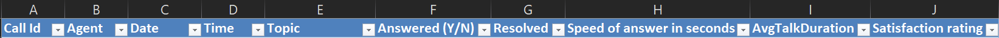
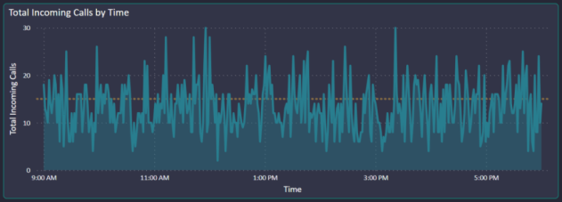
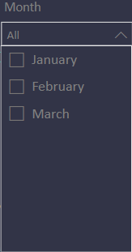

# Call Centre Trends
## Task

Prepare a dashboard for the Call Centre Manager to understand the trends.

Some of the KPIs requested for are:-                                         

+ _Overall customer satisfaction_
+ _Overall calls answered/abandoned_
+ _Calls by time_
+ _Average speed of answer_
+ _Agent’s performance quadrant -> average handle time (talk duration) vs calls answered_

  

### Resources

An excel file with the title _'Call Centre Dataset'_.

The Dataset has 5000 rows and the headers are as below

  
  

  
  
  
  
  

## Solution

I prepared an interactive dashboard using PowerBI for the Call Centre Manager of PhoneNow call Centre as shown below:

  
  
  

  

  

  

  

  

### Insights

Below are some of the insights you can get at a glance however there are more insights to discover as you interact with the dashboard. 

  

  

 
 
+ Total Calls were 5000 with 946 of them (19%) going unanswered.

_Click on the different sections of the ribbon to filter the whole dashboard by either answered/unanswered calls_

  
  
  
  

 

+ Average Talk Duration is 3.45 seconds
+ Average Satisfaction Score is 3.40 out of 5
+ Average Answer Speed is 67.52 seconds

  
  
  
  

+ Majority of the calls were received on Monday and Saturday with 770 and 768 calls repectively, while Tuesday received the lowest with 688.

_Click on the graph to filter the whole dashboard by a specific time of the day.(Working hours are 9:00am to 6:00pm)_

&nbsp; 
&nbsp; 
&nbsp; 
&nbsp; 

 
 

+ Jim and Dan answered the highest number of calls (536 & 523) while Joe answered the least (477).

_Click on the Agent's names to filter the dashboard by a specific agent_

&nbsp; 
&nbsp; 
&nbsp; 
&nbsp; 

### Filters

The Dashboard has three filters/slicers to enable further analysis.
&nbsp; 
&nbsp; 

| Topic | Month | Day of Week |
| --- | --- | --- |
|   |   |   |

### Link

Click below to access and interact with the Dashboard.
&nbsp; 
[Call Centre Dashboard](https://www.novypro.com/project/call-centre-dashboard-power-bi-3)

