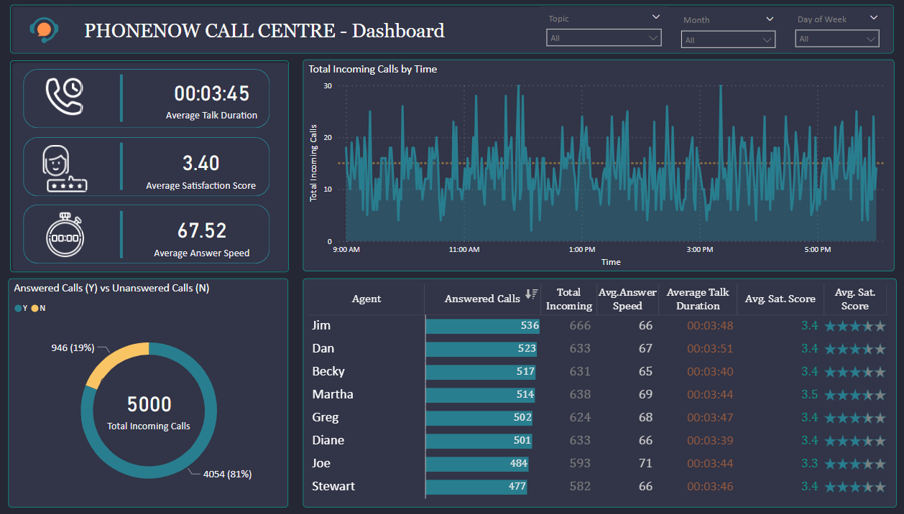
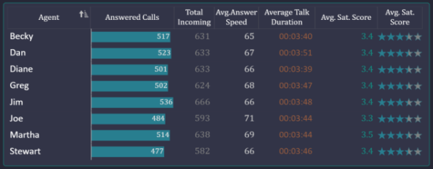

# Call Centre Trends
## Task

Prepare a dashboard for the Call Centre Manager to understand the trends.

Some of the KPIs requested for are:-                                         

+ _Overall customer satisfaction_
+ _Overall calls answered/abandoned_
+ _Calls by time_
+ _Average speed of answer_
+ _Agent’s performance quadrant -> average handle time (talk duration) vs calls answered_

     

### Resources
  

An excel file with the title _'Call Centre Dataset'_.

The Dataset has 5000 rows and the headers are as below

    

      

## Solution

  

I prepared an interactive dashboard using PowerBI for the Call Centre Manager of PhoneNow call Centre as shown below:

     

            

### Insights

  

Below are some of the insights you can get at a glance however there are more insights to discover as you interact with the dashboard. 

        

 
 
+ Total Calls were 5000 with 946 of them (19%) going unanswered  

       

 

+ Average Talk Duration is 3.45 seconds
+ Average Satisfaction Score is 3.40 out of 5
+ Average Answer Speed is 67.52 seconds

       

&nbsp; &nbsp; &nbsp; &nbsp;

 
 

&nbsp; &nbsp; &nbsp; &nbsp; 

### Filters

&nbsp; &nbsp; 

| Topic Filter | Monthly Filter |
| --- | --- |
|   |   |
