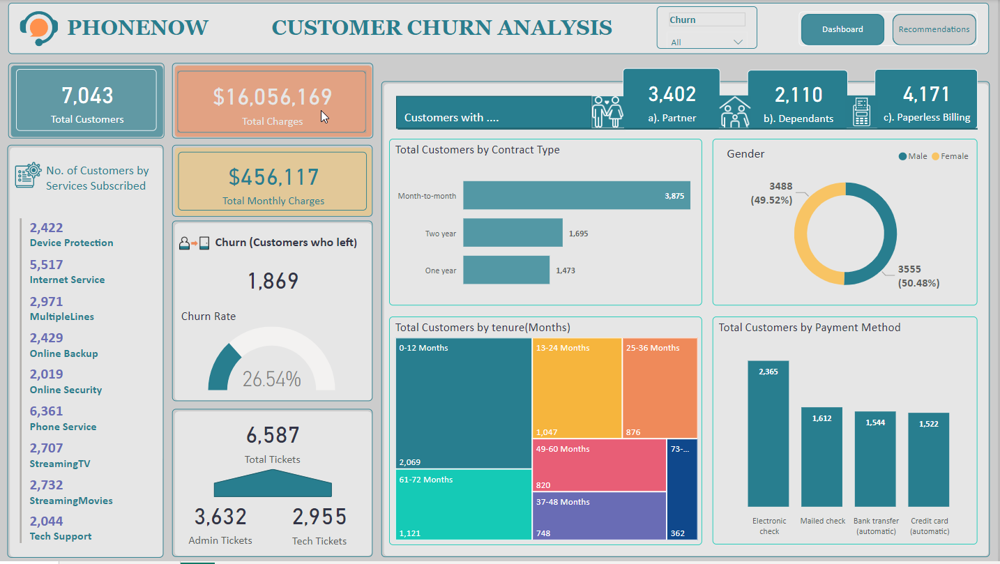

# Customer Retention

In addition, to better understand the data, the telecom Retention Manager has scheduled a meeting with the engagement partner  to cover these points:

+ _Customers in the telecom industry are hard-earned: we don’t want to lose them_
+ _The retention department is here to get customers back in case of termination_ 
+ _Currently, we get in touch after they have terminated the contract, but this is reactionary: it would be better to know in advance who is at risk_ 
+ _We  have done customer analysis with Excel: it has always ended in a dead-end_
+ _We would like to know more about our customers: visualised clearly so that it’s self-explanatory for our management_

## Task

Your colleague, the engagement partner, asks you to do the following tasks:
1.	Define proper KPIs
2.	Create a dashboard for the retention manager reflecting the KPIs
3.	Write a short email to him (the engagement partner) explaining your findings, and include suggestions as to what needs to be changed

### Resources

An excel dataset named "Churn Dataset" is provided. 
In addition to the dataset, the Retention Manager has provided further inputs as below:
+ _Customers who left within the last month_
+ _Services each customer has signed up for: phone, multiple lines, internet, online security, online backup, device protection, tech support, and streaming TV and movies_ 
+ _Customer account information: how long as a customer, contract, payment method, paperless billing, monthly charges, total charges and number of tickets opened in the categories administrative and technical_ 
+ _Demographic info about customers – gender, age range, and if they have partners and dependents_

## Solution

I prepared an interactive dashboard using PowerBI for the Retention Manager of PhoneNow call Centre as shown below:
&nbsp; 
&nbsp; 
&nbsp; 

&nbsp; 

&nbsp; 

&nbsp; 

### Link

Click to access and interact with the Dashboard.
&nbsp; 
&nbsp; 
[Customer Retention/Churn Analysis](https://www.novypro.com/project/customer-retentionchurn-analysis)
